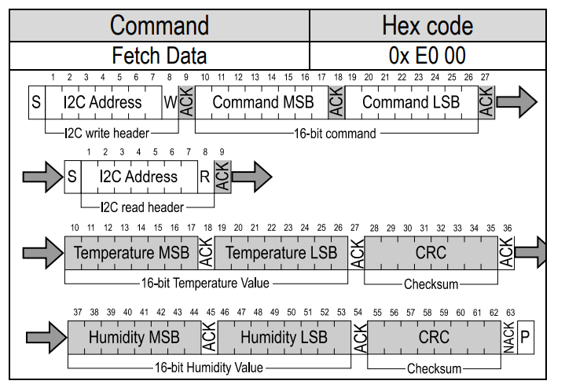

# Fake Data Generator for SHT30

模拟SHT30 Fetch Data格式生成的假数据。你甚至可以在FPGA开发板上加入生成的Verilog二进制数据，通过移位的方式输出最低位来假装你真的在和一块SHT30通讯。

## 请勿在论文及作业中使用！！！

## 通信协议


## 输出示例


```txt
SHT30波形仿真工具。By @Jiu_xiao
###############################################################
模拟温度：35.42°C 模拟湿度：0.436%
###############################################################
uint16: 温度：30116U 湿度：285U
###############################################################
原始数据
[1, 1, 0, 1, 0, 1, 0, 1, 0, 1, 0, 1, 0, 1, 0, 1, 0, 1, 0, 1, 0, 1, 0, 1, 0, 1, 0, 1, 0, 1, 0, 1, 0, 1, 0, 1, 0, 1, 0, 1, 0, 1, 0, 1, 0, 1, 0, 1, 0, 1, 0, 1, 0, 1, 0, 1, 1, 1, 0, 1, 0, 1, 0, 1, 0, 1, 0, 1, 0, 1, 0, 1, 0, 1, 0, 1, 0, 1, 0, 1, 0, 1, 0, 1, 0, 1, 0, 1, 0, 1, 0, 1, 0, 1, 0, 1, 0, 1, 0, 1, 0, 1, 0, 1, 0, 1, 0, 1, 0, 1, 0, 1, 0, 1, 0, 1, 0, 1, 0, 1, 0, 1, 0, 1, 0, 1, 0, 1, 0, 1, 0, 1, 0, 1, 0, 1, 0, 1, 0, 1, 0, 1, 0, 1, 0, 1, 0, 1, 0, 1, 0, 1, 0, 1, 0, 1, 0, 1, 0, 1, 0, 1, 0, 1, 0, 1, 0, 1, 0, 1, 0, 1, 0, 1, 0, 1, 0, 1, 0, 1, 0, 1, 0, 1, 1, 1]
[1, 0, 1, 1, 0, 0, 0, 0, 0, 0, 1, 1, 0, 0, 0, 0, 0, 0, 0, 0, 1, 1, 1, 1, 1, 1, 0, 0, 0, 0, 0, 0, 0, 0, 0, 0, 0, 0, 0, 0, 0, 0, 0, 0, 0, 0, 0, 0, 0, 0, 0, 0, 0, 0, 0, 0, 1, 0, 1, 1, 0, 0, 0, 0, 0, 0, 1, 1, 0, 0, 0, 0, 1, 1, 0, 0, 0, 0, 1, 1, 1, 1, 1, 1, 0, 0, 1, 1, 0, 0, 1, 1, 0, 0, 1, 1, 0, 0, 1, 1, 0, 0, 0, 0, 1, 1, 0, 0, 0, 0, 0, 0, 1, 1, 1, 1, 0, 0, 1, 1, 0, 0, 0, 0, 0, 0, 1, 1, 0, 0, 0, 0, 0, 0, 0, 0, 0, 0, 0, 0, 0, 0, 0, 0, 1, 1, 0, 0, 0, 0, 0, 0, 0, 0, 1, 1, 1, 1, 1, 1, 0, 0, 1, 1, 0, 0, 0, 0, 0, 0, 0, 0, 1, 1, 1, 1, 1, 1, 0, 0, 0, 0, 1, 1, 0, 1]
###############################################################
波形预览
scl start:-- addr_w:_-_-_-_-_-_-_-_- ack:_- cmd_msb:_-_-_-_-_-_-_-_- ack:_- cmd_lsb:_-_-_-_-_-_-_-_- ack:_- start:-- addr_r:_-_-_-_-_-_-_-_- ack:_- temp_msb:_-_-_-_-_-_-_-_- ack:_- temp_lsb:_-_-_-_-_-_-_-_- ack:_- crc:_-_-_-_-_-_-_-_- ack:_- rh_msb:_-_-_-_-_-_-_-_- ack:_- rh_lsb:_-_-_-_-_-_-_-_- ack:_- crc:_-_-_-_-_-_-_-_- no_ack:_- stop:--
sda start:-_ addr_w:--______--______ ack:__ cmd_msb:------__________ ack:__ cmd_lsb:________________ ack:__ start:-_ addr_r:--______--____-- ack:__ temp_msb:__------__--__-- ack:__ temp_lsb:--__--____--____ ack:__ crc:----__--______-- ack:__ rh_msb:______________-- ack:__ rh_lsb:______------__-- ack:__ crc:______------____ no_ack:-- stop:_-
###############################################################
Verilog二进制数据
scl:
	186'b110101010101010101010101010101010101010101010101010101011101010101010101010101010101010101010101010101010101010101010101010101010101010101010101010101010101010101010101010101010101010111
sda:
	186'b101100000011000000001111110000000000000000000000000000001011000000110000110000111111001100110011001100001100000011110011000000110000000000000000110000000011111100110000000011111100001101
###############################################################
感谢使用
```